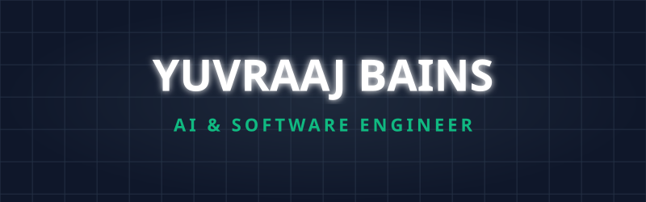

<picture>
  
</picture>

 

<table align="center" border="0">
<tr>
<td width="38%" align="center" valign="middle">

</td>
<td width="62%" valign="middle">

### 🚀 Experience & Projects

| 🌟 Role / Project | 💻 Tech Stack | 📌 Focus |
|:---|:---:|:---:|
| **Incoming SWE @ RBC** | `Python` `LLMs` | Agentic AI & Big Data |
| **SWE Intern @ Nokia** | `Python` `K8s` | SWE & AI Infra |
| **RavenMap** | `Python` `LangGraph` | Deterministic AI Agents |
| **Aura-Grid** | `Python` `Kafka` | Distributed ML |
| **Resonance** | `PyTorch` `Ruby` | ML Recommendations |

 

> ⚡ *"Building scalable backend systems and intelligent AI solutions."*

</td>
</tr>
</table>

 

### 🛠️ Tech Stack & Skills

  <a href="https://skillicons.dev">
    
      
    
      
    
  </a>

  

### 📊 GitHub Streaks

  

  

### 🐍 Watch the snake eat my contributions

<picture>
  <source media="(prefers-color-scheme: dark)" srcset="https://github.com/yuviib/yuviib/blob/output/github-contribution-grid-snake-dark.svg?raw=true">
  <source media="(prefers-color-scheme: light)" srcset="https://github.com/yuviib/yuviib/blob/output/github-contribution-grid-snake.svg?raw=true">
  
</picture>

  

### 📫 Let's Connect

  

*⭐️ Keep building, keep learning.* ⚡

